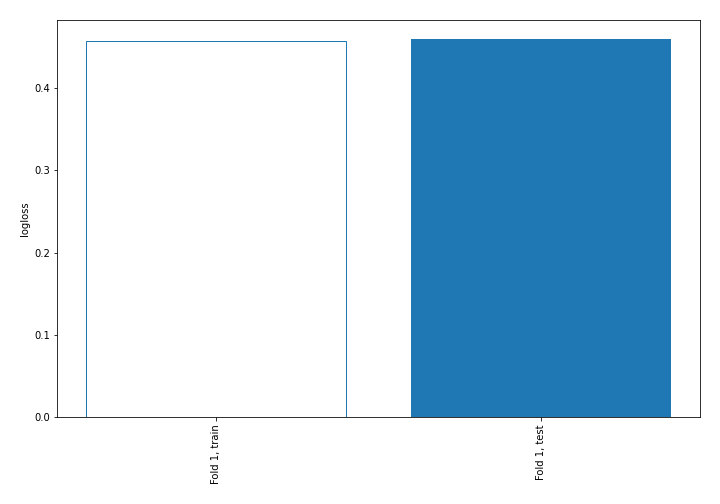
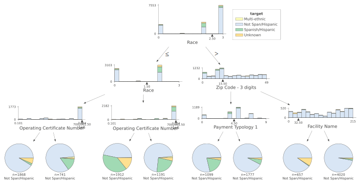
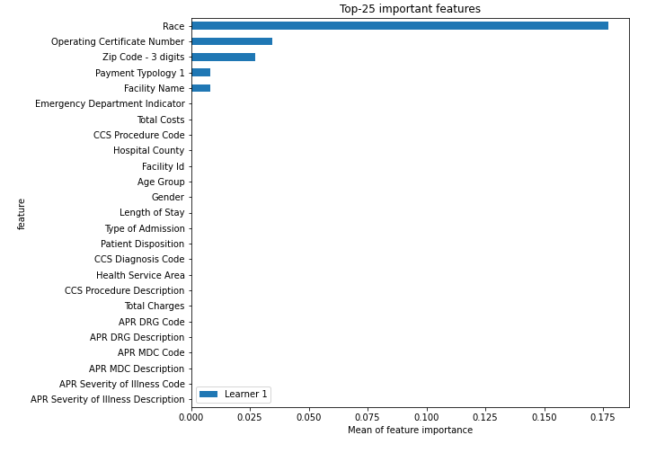
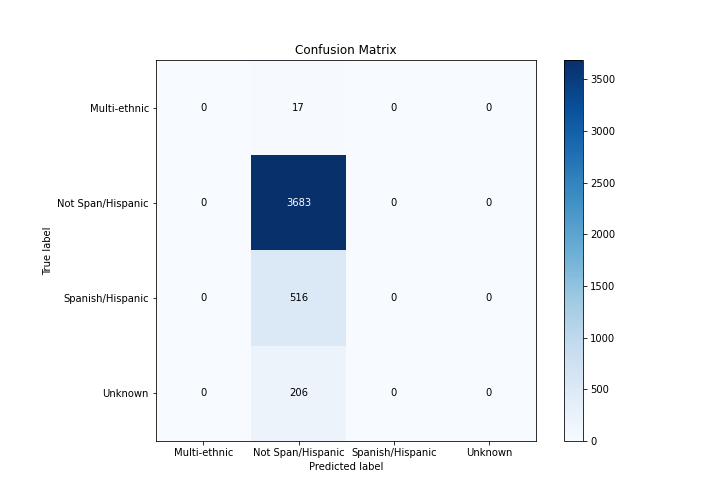
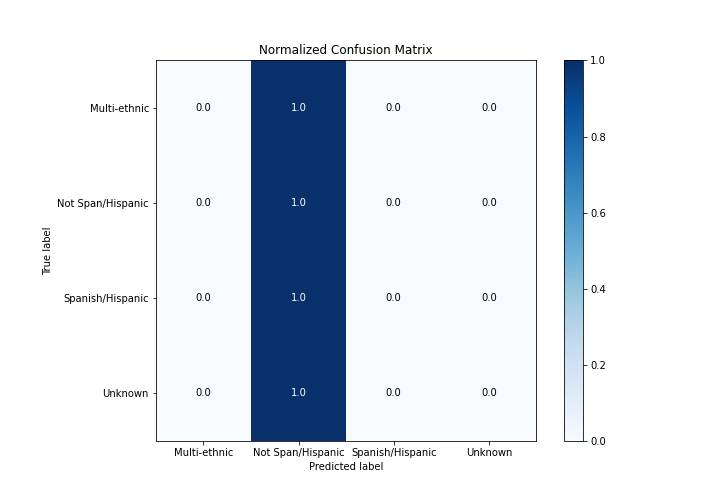
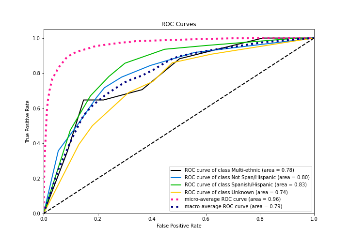
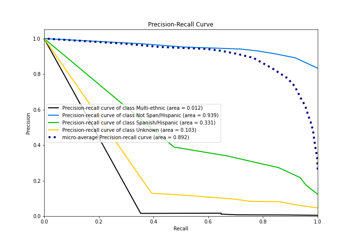
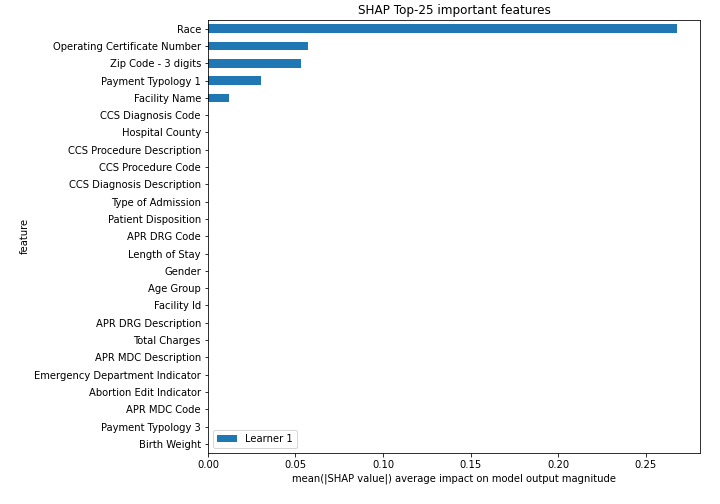
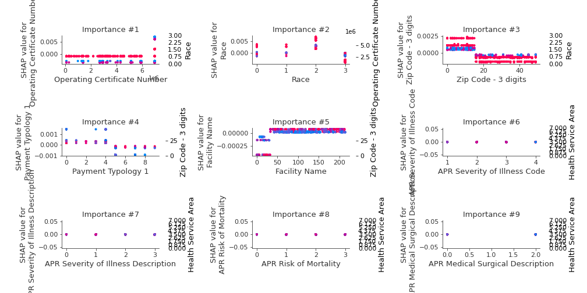

# Summary of 2_DecisionTree

[<< Go back](../README.md)

## Decision Tree
- **n_jobs**: -1
- **criterion**: gini
- **max_depth**: 3
- **num_class**: 4
- **explain_level**: 2

## Validation
 - **validation_type**: split
 - **train_ratio**: 0.75
 - **shuffle**: True
 - **stratify**: True

## Optimized metric
logloss

## Training time

18.3 seconds

### Metric details
|           |   Multi-ethnic |   Not Span/Hispanic |   Spanish/Hispanic |   Unknown |   accuracy |   macro avg |   weighted avg |   logloss |
|:----------|---------------:|--------------------:|-------------------:|----------:|-----------:|------------:|---------------:|----------:|
| precision |              0 |            0.832881 |                  0 |         0 |   0.832881 |    0.20822  |       0.693691 |  0.459316 |
| recall    |              0 |            1        |                  0 |         0 |   0.832881 |    0.25     |       0.832881 |  0.459316 |
| f1-score  |              0 |            0.908822 |                  0 |         0 |   0.832881 |    0.227205 |       0.75694  |  0.459316 |
| support   |             17 |         3683        |                516 |       206 |   0.832881 | 4422        |    4422        |  0.459316 |

## Confusion matrix
|                              |   Predicted as Multi-ethnic |   Predicted as Not Span/Hispanic |   Predicted as Spanish/Hispanic |   Predicted as Unknown |
|:-----------------------------|----------------------------:|---------------------------------:|--------------------------------:|-----------------------:|
| Labeled as Multi-ethnic      |                           0 |                               17 |                               0 |                      0 |
| Labeled as Not Span/Hispanic |                           0 |                             3683 |                               0 |                      0 |
| Labeled as Spanish/Hispanic  |                           0 |                              516 |                               0 |                      0 |
| Labeled as Unknown           |                           0 |                              206 |                               0 |                      0 |

## Learning curves

## Decision Tree 

### Tree #1

### Rules

if (Race > 2.5) and (Zip Code - 3 digits > 15.5) and (Facility Name > 32.5) then class: Not Span/Hispanic (proba: 96.97%) | based on 4,020 samples

if (Race <= 2.5) and (Race > 1.5) and (Operating Certificate Number <= 7002001.5) then class: Not Span/Hispanic (proba: 46.39%) | based on 1,912 samples

if (Race <= 2.5) and (Race <= 1.5) and (Operating Certificate Number <= 7002001.5) then class: Not Span/Hispanic (proba: 91.22%) | based on 1,868 samples

if (Race > 2.5) and (Zip Code - 3 digits <= 15.5) and (Payment Typology 1 > 4.5) then class: Not Span/Hispanic (proba: 92.18%) | based on 1,777 samples

if (Race <= 2.5) and (Race > 1.5) and (Operating Certificate Number > 7002001.5) then class: Not Span/Hispanic (proba: 71.62%) | based on 1,191 samples

if (Race > 2.5) and (Zip Code - 3 digits <= 15.5) and (Payment Typology 1 <= 4.5) then class: Not Span/Hispanic (proba: 78.07%) | based on 1,099 samples

if (Race <= 2.5) and (Race <= 1.5) and (Operating Certificate Number > 7002001.5) then class: Not Span/Hispanic (proba: 83.4%) | based on 741 samples

if (Race > 2.5) and (Zip Code - 3 digits > 15.5) and (Facility Name <= 32.5) then class: Not Span/Hispanic (proba: 90.11%) | based on 657 samples

## Permutation-based Importance

## Confusion Matrix

## Normalized Confusion Matrix

## ROC Curve

## Precision Recall Curve

## SHAP Importance

## SHAP Dependence plots

### Dependence Multi-ethnic (Fold 1)

[<< Go back](../README.md)
