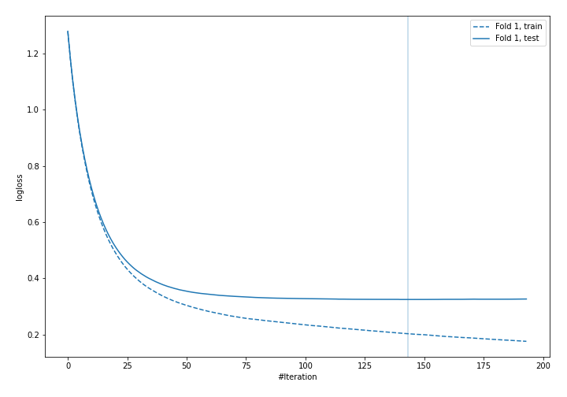
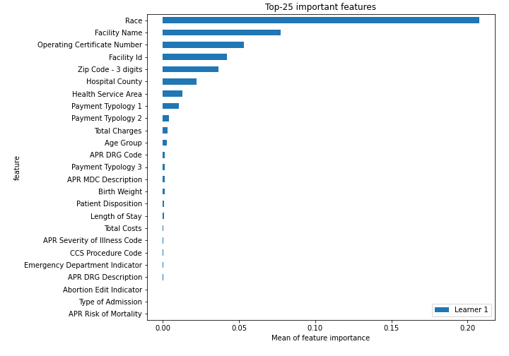
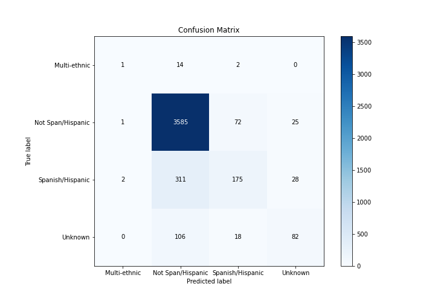
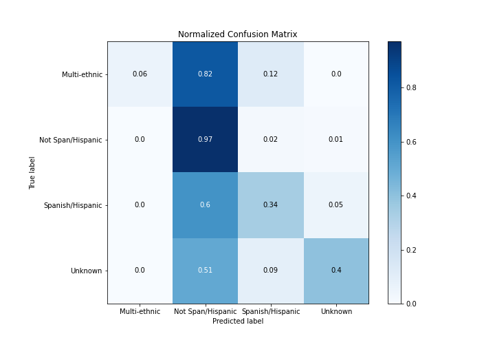
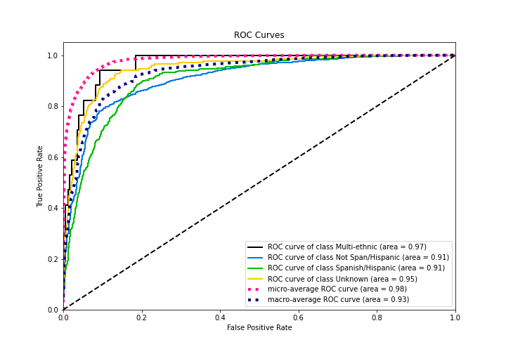
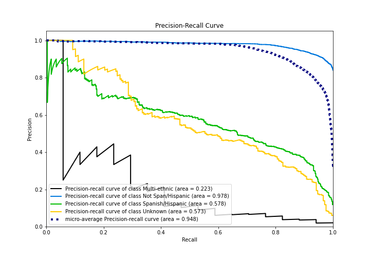
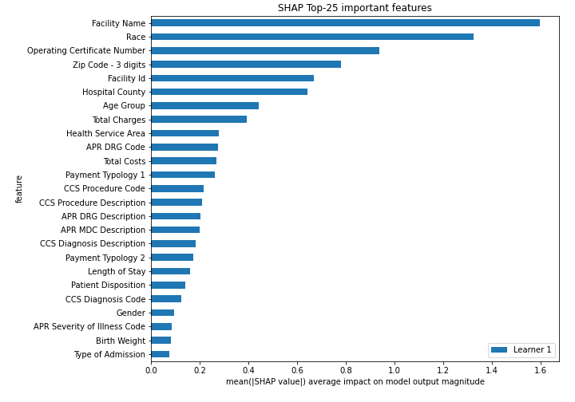
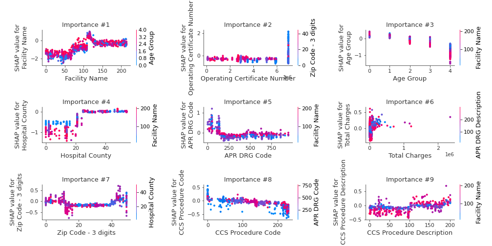

# Summary of 3_Default_Xgboost

[<< Go back](../README.md)

## Extreme Gradient Boosting (Xgboost)
- **n_jobs**: -1
- **objective**: multi:softprob
- **eta**: 0.075
- **max_depth**: 6
- **min_child_weight**: 1
- **subsample**: 1.0
- **colsample_bytree**: 1.0
- **eval_metric**: mlogloss
- **num_class**: 4
- **explain_level**: 2

## Validation
 - **validation_type**: split
 - **train_ratio**: 0.75
 - **shuffle**: True
 - **stratify**: True

## Optimized metric
logloss

## Training time

33.7 seconds

### Metric details
|           |   Multi-ethnic |   Not Span/Hispanic |   Spanish/Hispanic |    Unknown |   accuracy |   macro avg |   weighted avg |   logloss |
|:----------|---------------:|--------------------:|-------------------:|-----------:|-----------:|------------:|---------------:|----------:|
| precision |      0.25      |            0.892679 |           0.655431 |   0.607407 |   0.869064 |    0.601379 |       0.849235 |  0.324699 |
| recall    |      0.0588235 |            0.973391 |           0.339147 |   0.398058 |   0.869064 |    0.442355 |       0.869064 |  0.324699 |
| f1-score  |      0.0952381 |            0.93129  |           0.446999 |   0.480938 |   0.869064 |    0.488616 |       0.850584 |  0.324699 |
| support   |     17         |         3683        |         516        | 206        |   0.869064 | 4422        |    4422        |  0.324699 |

## Confusion matrix
|                              |   Predicted as Multi-ethnic |   Predicted as Not Span/Hispanic |   Predicted as Spanish/Hispanic |   Predicted as Unknown |
|:-----------------------------|----------------------------:|---------------------------------:|--------------------------------:|-----------------------:|
| Labeled as Multi-ethnic      |                           1 |                               14 |                               2 |                      0 |
| Labeled as Not Span/Hispanic |                           1 |                             3585 |                              72 |                     25 |
| Labeled as Spanish/Hispanic  |                           2 |                              311 |                             175 |                     28 |
| Labeled as Unknown           |                           0 |                              106 |                              18 |                     82 |

## Learning curves

## Permutation-based Importance

## Confusion Matrix

## Normalized Confusion Matrix

## ROC Curve

## Precision Recall Curve

## SHAP Importance

## SHAP Dependence plots

### Dependence Multi-ethnic (Fold 1)

[<< Go back](../README.md)
