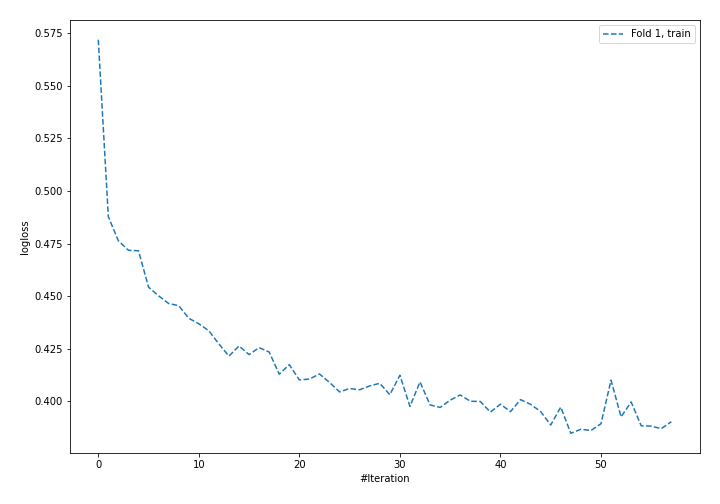
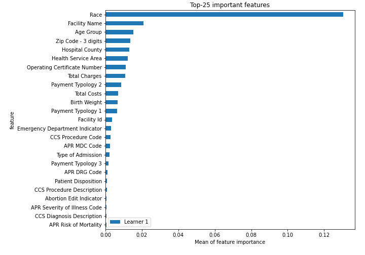
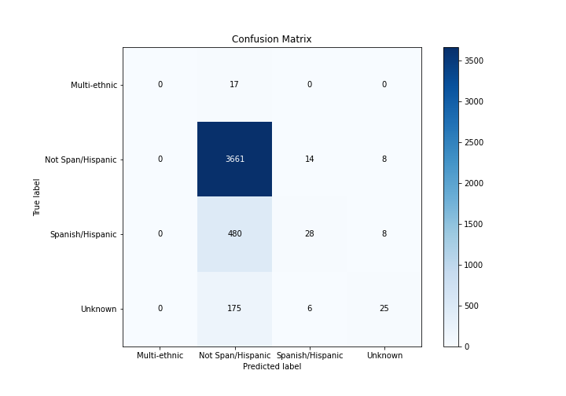
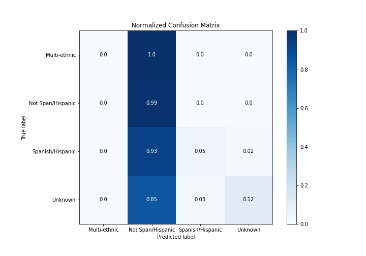
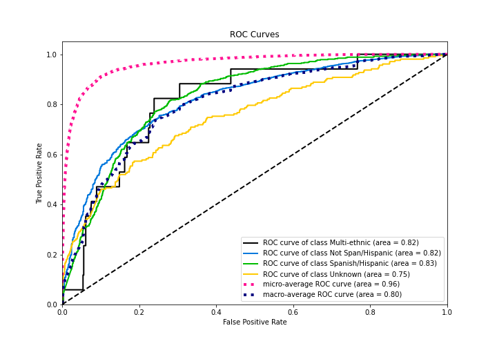
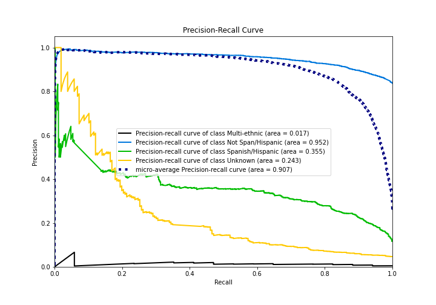

# Summary of 4_Default_NeuralNetwork

[<< Go back](../README.md)

## Neural Network
- **n_jobs**: -1
- **dense_1_size**: 32
- **dense_2_size**: 16
- **learning_rate**: 0.05
- **num_class**: 4
- **explain_level**: 2

## Validation
 - **validation_type**: split
 - **train_ratio**: 0.75
 - **shuffle**: True
 - **stratify**: True

## Optimized metric
logloss

## Training time

7.4 seconds

### Metric details
|           |   Multi-ethnic |   Not Span/Hispanic |   Spanish/Hispanic |    Unknown |   accuracy |   macro avg |   weighted avg |   logloss |
|:----------|---------------:|--------------------:|-------------------:|-----------:|-----------:|------------:|---------------:|----------:|
| precision |              0 |            0.844911 |          0.583333  |   0.609756 |   0.839891 |    0.5095   |       0.800185 |  0.466572 |
| recall    |              0 |            0.994027 |          0.0542636 |   0.121359 |   0.839891 |    0.292412 |       0.839891 |  0.466572 |
| f1-score  |              0 |            0.913423 |          0.0992908 |   0.202429 |   0.839891 |    0.303786 |       0.781789 |  0.466572 |
| support   |             17 |         3683        |        516         | 206        |   0.839891 | 4422        |    4422        |  0.466572 |

## Confusion matrix
|                              |   Predicted as Multi-ethnic |   Predicted as Not Span/Hispanic |   Predicted as Spanish/Hispanic |   Predicted as Unknown |
|:-----------------------------|----------------------------:|---------------------------------:|--------------------------------:|-----------------------:|
| Labeled as Multi-ethnic      |                           0 |                               17 |                               0 |                      0 |
| Labeled as Not Span/Hispanic |                           0 |                             3661 |                              14 |                      8 |
| Labeled as Spanish/Hispanic  |                           0 |                              480 |                              28 |                      8 |
| Labeled as Unknown           |                           0 |                              175 |                               6 |                     25 |

## Learning curves

## Permutation-based Importance

## Confusion Matrix

## Normalized Confusion Matrix

## ROC Curve

## Precision Recall Curve

[<< Go back](../README.md)
