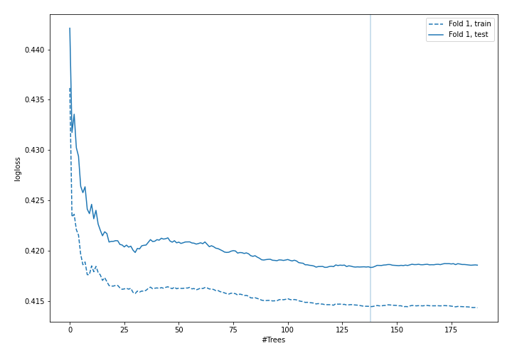
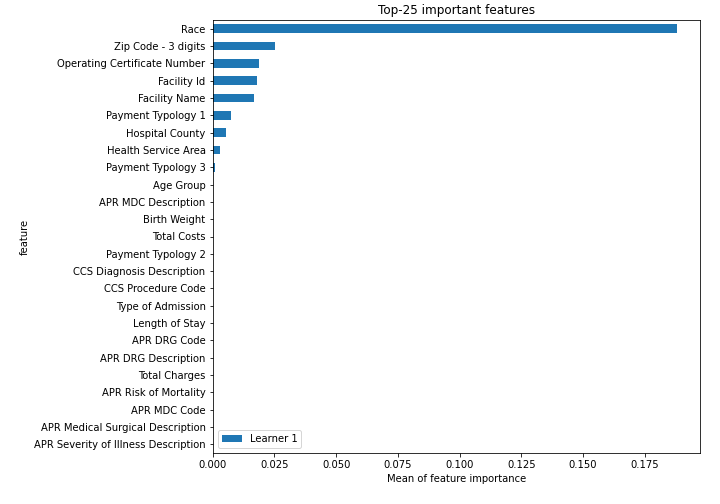
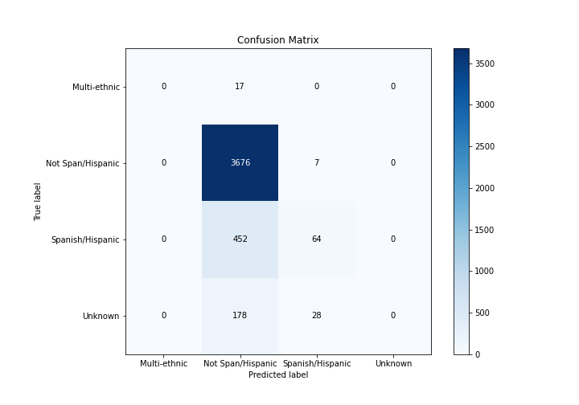
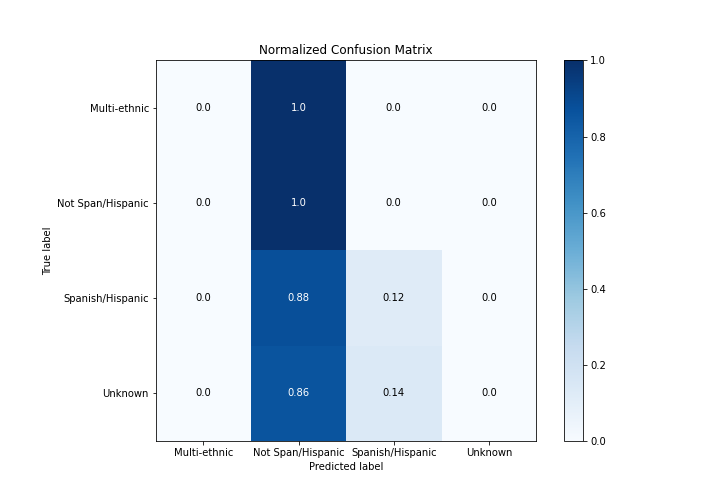
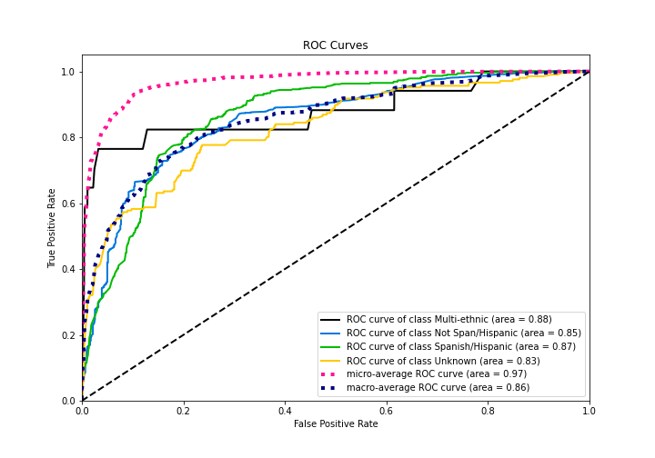
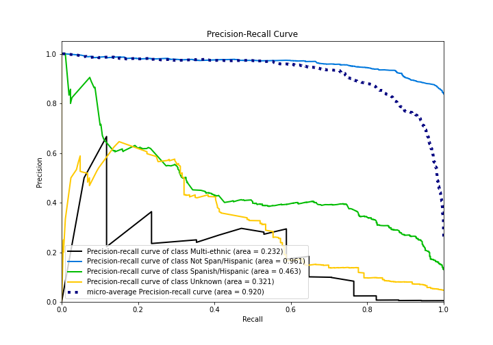
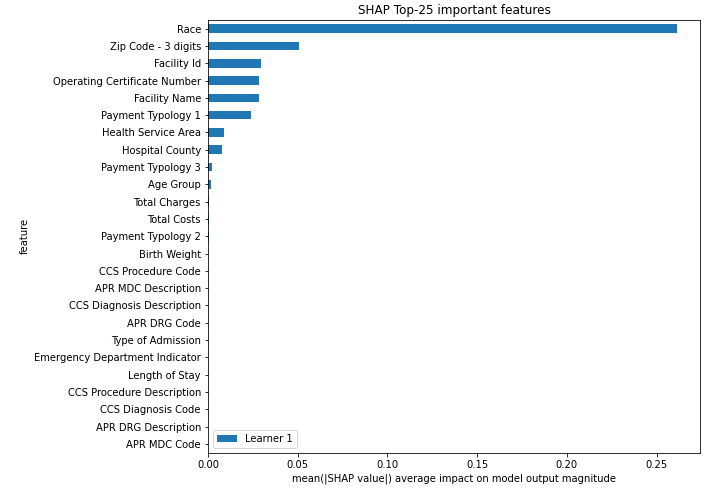
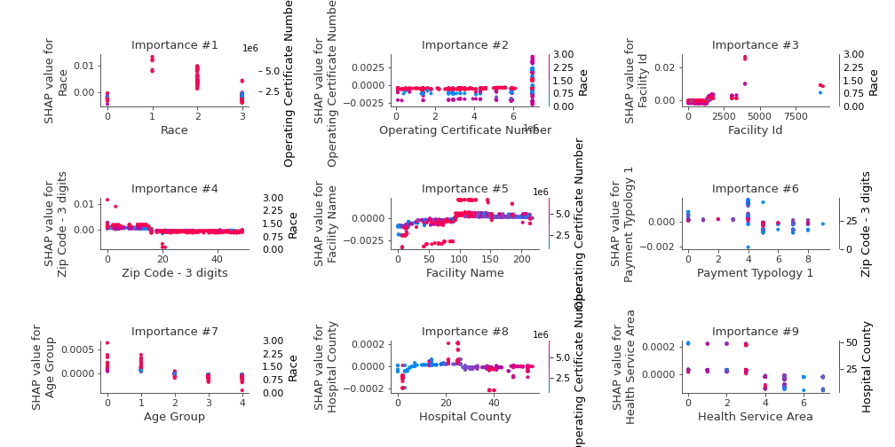

# Summary of 5_Default_RandomForest

[<< Go back](../README.md)

## Random Forest
- **n_jobs**: -1
- **criterion**: gini
- **max_features**: 0.9
- **min_samples_split**: 30
- **max_depth**: 4
- **eval_metric_name**: logloss
- **num_class**: 4
- **explain_level**: 2

## Validation
 - **validation_type**: split
 - **train_ratio**: 0.75
 - **shuffle**: True
 - **stratify**: True

## Optimized metric
logloss

## Training time

31.7 seconds

### Metric details
|           |   Multi-ethnic |   Not Span/Hispanic |   Spanish/Hispanic |   Unknown |   accuracy |   macro avg |   weighted avg |   logloss |
|:----------|---------------:|--------------------:|-------------------:|----------:|-----------:|------------:|---------------:|----------:|
| precision |              0 |            0.850335 |           0.646465 |         0 |   0.845771 |    0.3742   |       0.783664 |  0.418331 |
| recall    |              0 |            0.998099 |           0.124031 |         0 |   0.845771 |    0.280533 |       0.845771 |  0.418331 |
| f1-score  |              0 |            0.918311 |           0.20813  |         0 |   0.845771 |    0.28161  |       0.789131 |  0.418331 |
| support   |             17 |         3683        |         516        |       206 |   0.845771 | 4422        |    4422        |  0.418331 |

## Confusion matrix
|                              |   Predicted as Multi-ethnic |   Predicted as Not Span/Hispanic |   Predicted as Spanish/Hispanic |   Predicted as Unknown |
|:-----------------------------|----------------------------:|---------------------------------:|--------------------------------:|-----------------------:|
| Labeled as Multi-ethnic      |                           0 |                               17 |                               0 |                      0 |
| Labeled as Not Span/Hispanic |                           0 |                             3676 |                               7 |                      0 |
| Labeled as Spanish/Hispanic  |                           0 |                              452 |                              64 |                      0 |
| Labeled as Unknown           |                           0 |                              178 |                              28 |                      0 |

## Learning curves

## Permutation-based Importance

## Confusion Matrix

## Normalized Confusion Matrix

## ROC Curve

## Precision Recall Curve

## SHAP Importance

## SHAP Dependence plots

### Dependence Multi-ethnic (Fold 1)

[<< Go back](../README.md)
